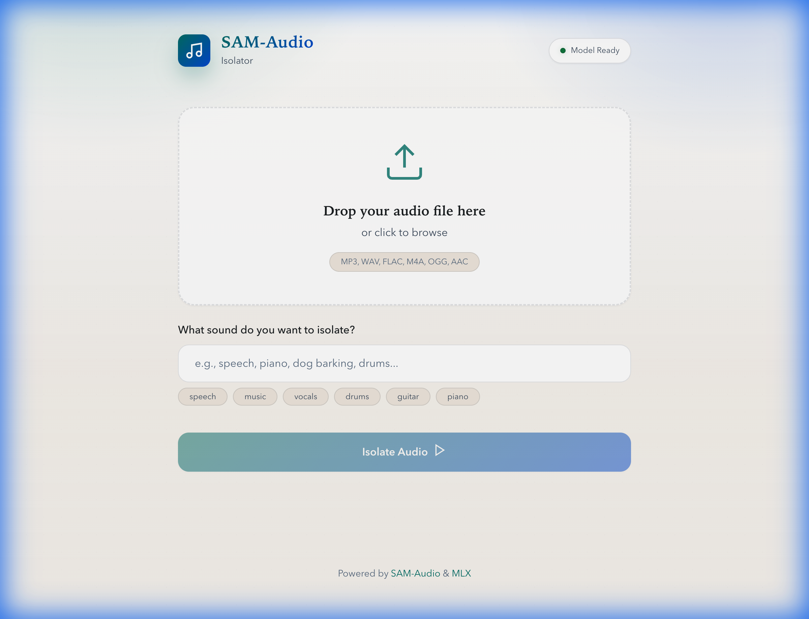

# SAM-Audio Isolation Utility

A local audio isolation utility powered by Meta's SAM-Audio model, optimized for Apple Silicon via MLX.

  

## Features

- 🎵 **Text-prompted audio isolation** - Describe what you want to extract (speech, vocals, drums, piano, etc.)
- 🖥️ **Modern web interface** - Dark theme with drag-and-drop upload
- 🍎 **Apple Silicon optimized** - Uses MLX for fast inference on M Series Macs
- 📦 **Easy setup** - Single script handles everything

## Screenshot



## Requirements

- **Hardware**: Apple Silicon Mac (M Series)
- **RAM**: 16GB minimum (64GB recommended for best performance)
- **macOS**: 14.0 or later
- **Python**: 3.10 or later (auto-downloaded if missing)

## Python Setup

This application requires **Python 3.10 or later**. If your Mac only has the system Python, `run.sh` will automatically download a private Python runtime into `.python/` and use it (no system changes).

**Auto-download requirements:**
- `curl` available (built into macOS)
- Internet access
- ~150MB free disk space

To force a re-download, delete the `.python/` directory and run `./run.sh` again.

## Quick Start

```bash
# Clone the repository
git clone https://github.com/cmd-christopher/Mac-GUI-for-SAM-Audio.git
cd Mac-GUI-for-SAM-Audio

# Run the application (creates venv, installs deps, downloads model)
./run.sh
```

Then open the URL printed in the terminal (starts at **http://localhost:5001** and auto-adjusts if that port is busy).

> **Note**: On first run, the model (~4.8GB) will be downloaded automatically. This is a one-time process.

## Usage

1. **Upload** an audio file (MP3, WAV, FLAC, M4A, OGG, AAC)
2. **Describe** the sound to isolate (e.g., "speech", "piano", "drums")
3. **Click** "Isolate Audio"
4. **Listen** to the isolated audio and residual
5. **Download** the results as WAV files

### Example Prompts

| Prompt | Isolates |
|--------|----------|
| `speech` | Human voices |
| `vocals` | Singing in music |
| `drums` | Percussion |
| `piano` | Piano instrument |
| `guitar` | Guitar sounds |
| `music` | All musical elements |

## Project Structure

```
Mac-GUI-for-SAM-Audio/
├── app.py                 # Flask web application
├── audio_processor.py     # SAM-Audio model wrapper
├── requirements.txt       # Python dependencies
├── run.sh                 # Startup script
├── templates/
│   └── index.html         # Web interface
└── static/
    ├── css/style.css      # Styling
    └── js/app.js          # Frontend logic
```

## Technical Details

- **Model**: [mlx-community/sam-audio-large-fp16](https://huggingface.co/mlx-community/sam-audio-large-fp16)
- **Framework**: MLX (Apple's machine learning framework)
- **Backend**: Flask
- **Sample Rate**: 24kHz
- **Output Format**: WAV

## Troubleshooting

### "Python 3.10+ is required" error
The automatic Python download failed or was blocked. Re-run `./run.sh` with a working internet connection, or delete `.python/` and try again.

### Port 5001 in use
The app automatically selects the next available port and prints it at startup. To force a specific port, run:

```bash
SAM_AUDIO_PORT=5005 ./run.sh
```

### Model download fails
Ensure you have a stable internet connection. The model (~4.8GB) is downloaded from Hugging Face.

### Out of memory
Enable "Long audio mode" checkbox for files over 30 seconds - this uses chunked processing.

### "resolution-too-deep" pip error
This usually means the bundled environment didn't finish installing dependencies. Delete `.python/` and `venv/`, then run `./run.sh` again.

## Credits

- [SAM-Audio](https://ai.meta.com/blog/sam-audio/) by Meta AI
- [MLX](https://ml-explore.github.io/mlx/) by Apple
- [mlx-audio](https://github.com/lucasnewman/mlx-audio) by Lucas Newman

## License

MIT License - See [LICENSE](LICENSE) for details.
